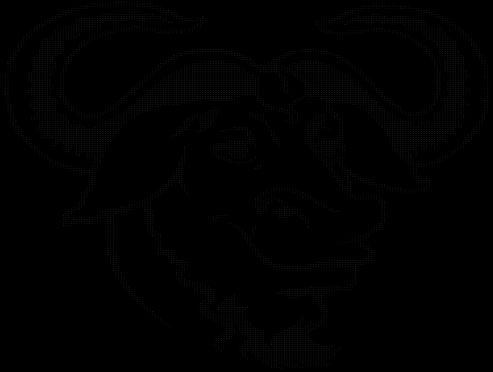

# Asciify (WIP)
Transform images to ascii text

# Quick Start Guide
```bash
git clone git@github.com:CryptoRodeo/asciify.git

cd ./asciify

docker build . -t asciify

docker run -it --name="asciify" asciify

# Check help menu
$ python asciify -h
usage: asciify [-h] [-f FILE_NAME] [-s SHRINK_RATIO] [-o OUTPUT_FILE] [-m CHAR_MAP]

options:
  -h, --help            show this help message and exit
  -f FILE_NAME, --file_name FILE_NAME
                        image file to process (required)
  -s SHRINK_RATIO, --shrink_ratio SHRINK_RATIO
                        shrink ratio for image, defaults to 1
  -o OUTPUT_FILE, --output_file OUTPUT_FILE
                        file to output to, defaults to res.txt
  -m CHAR_MAP, --char_map CHAR_MAP
                        char map file to map pixel values to characters, defaults to character_maps/default.json

# Asciify one of the test images
$ python asciify -f images/test.png -s 20 -o res.txt

# Change the character map to get different results
$ python asciify -f images/peng.png -s 20 -o res.txt -m character_maps/basic.json
```

# Details

### Shrink ratio:
- the "shrink ratio" is the amount we want to equally divide the height and width of the image by
- the **default shrink ratio** is 1, so the output is generated based on the image's original size
- the **smaller** the shrink ratio, the more detail we can capture in the ascii graphic **but** the less viewable the output is without zooming out
- the **higher** the shrink ratio, the less details we'll capture in the ascii graphic, **but** viewing the output is a lot easier

**Examples of differing shrink ratios**

Running the following snippet:
```
python asciify -f images/gnu.png -o res.txt
```

generates the following image (~300% zoom out):



Now lets apply a shrink ratio of 10 to that same image and see what happens:
```bash
python asciify -f images/gnu.png -s 10 -o res.txt
```

This is what the output looks like:

```
                                                               
          -  .  *  *  -  -              -  .  .  .  -          
       -  •  *  -  -  -  -              -  -  -  .  •  -       
       .  •              -  .  -  -  .  -           *  *       
       •  *           •  •  •  •  .  •  •  .        -  •       
       •  *        •  •  •  •  .     -  •  •  .     .  •       
       .  •  .  •  .     .  -     -  -  -     •  *  •  *       
       -  •  •  *           .  .     -  •     .  •  •  -       
          -  *              -  .        •        .  -          
             -        -                    .     -             
             -  -  .  -        -  .  -     -  -                
          -  .  .  -              -  -        -                
                -     -        -           -                   
                -     -  -        -  -  -  .                   
                -        .           .  .  -                   
                   -     -  •  -     -  -                      
                            •  •  -  *                         
                               •  •  •  .                      
                                  .  .  -                      
                                                               
                                                               
```

Less detailed, but more viewable.

---

### Character Maps:
- stored in the `character_maps` directory
- character maps are json files that map a character to a grayscale image pixel value ranging from 0 to 255
- you can customize the characters and pixel value ranges to get more or less specific with the output

**Using the default char map file:**
```bash
# Note: The default map is used even if not specified
python asciify -f images/peng.png -s 10 -m character_maps/default.json -o res.txt  
```

generates the following result (~300% zoom out):


**Using the basic char map file:**
```bash
# Note: this file consists of just two characters, white space and a dash
python asciify -f images/peng.png -s 10 -m character_maps/basic.json -o res.txt  
```

generates the following result (~300% zoom out):


---

### Do my images need to be in grayscale?
- **No**, a temp image is created from your image and it's converted to grayscale and shrunk down using the shrink ratio
- After the conversion is completed, the temp image is deleted